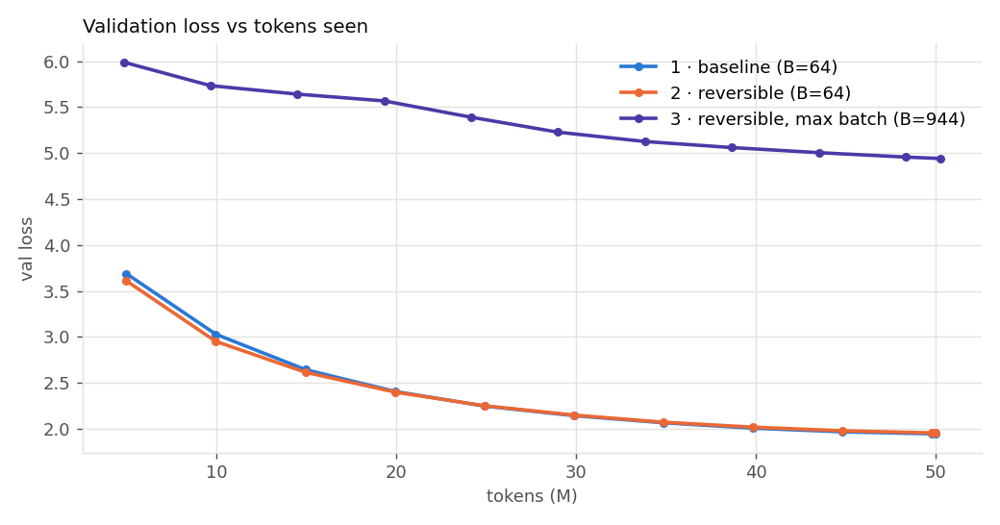
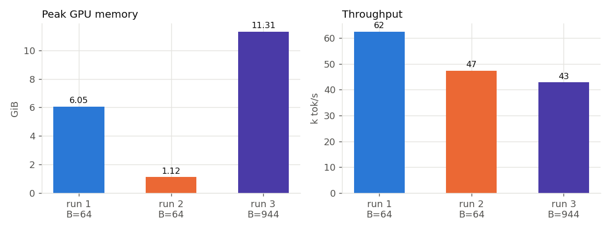
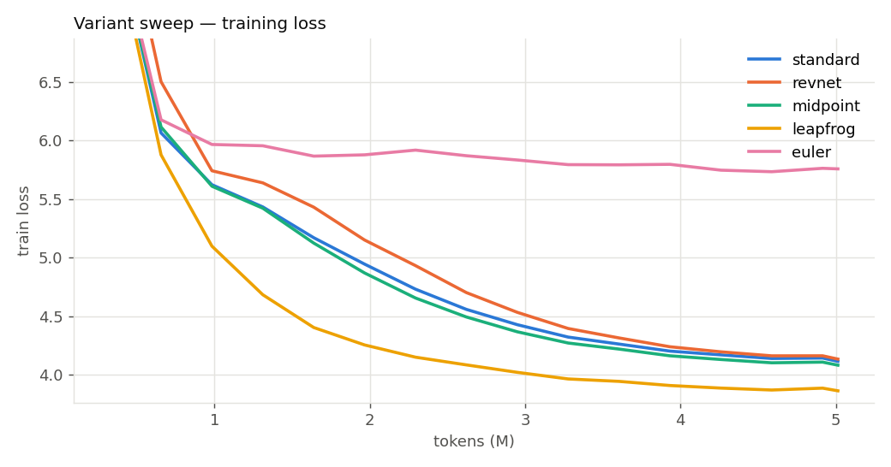
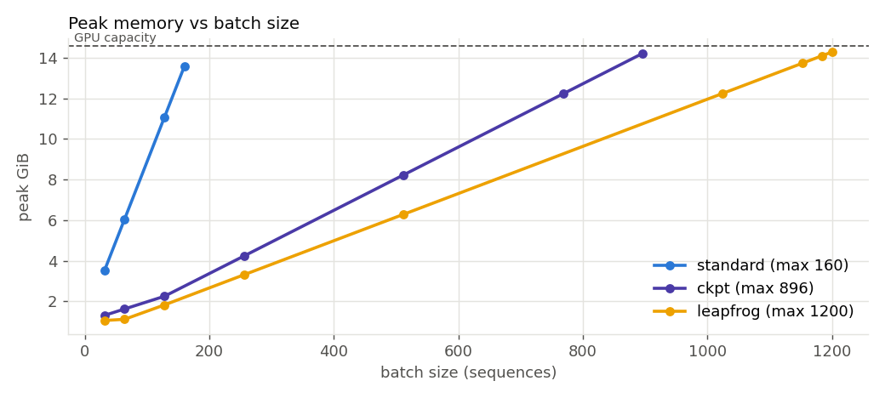

# S13 · Reversible training of a 20M LLM

Assignment: train a 20M LLM for 50M tokens at a fixed batch size, train it again with
reversibility (and report which variant worked: midpoint, Euler, …), then train the
reversible model again at the maximum batch size. Report final loss, speed (tokens/s),
peak memory and other findings.

📓 **[`S13_Reversible_LM.ipynb`](S13_Reversible_LM.ipynb)** is self-contained. Upload it to
Colab, pick a GPU runtime and run all cells. It writes `report/results.md` with every table
and plot below filled in from the actual runs.

📓 **[`S13_Reversible_LM_executed.ipynb`](S13_Reversible_LM_executed.ipynb)** is that notebook
as it came back from Colab, with outputs: the T4 banner, `all reversible tests passed`, the
variant selection, and the rendered report with its charts. Its training stages print
"exists, skipping" because this was the session that reran only `run3` — the earlier stages
were already finished on Drive. The numbers from all of them are in
[`colab_results/`](colab_results/).

All numbers below come from one Colab session on a **Tesla T4 (15 GB, fp16 + GradScaler)**,
19 Sep 2026. The raw JSON and the generated report are in [`colab_results/`](colab_results/)
([`report/results.md`](colab_results/report/results.md)).

## Results

| run | variant | batch | tokens/step | steps | final train loss | **final val loss** | **tok/s** | **peak mem** | train time |
|---|---|---|---|---|---|---|---|---|---|
| 1 · baseline | standard | 64 | 32,768 | 1,526 | 1.9234 | **1.9492** | **62,435** | **6.05 GiB** | 13.4 min |
| 2 · reversible | leapfrog | 64 | 32,768 | 1,526 | 1.9334 | **1.9606** | **47,387** | **1.12 GiB** | 17.6 min |
| 3 · reversible, max batch | leapfrog | **944** | 483,328 | 104 | 4.9305 | **4.9428** | **42,852** | **11.31 GiB** | 19.6 min |

Model state (params + grads + AdamW) is 0.32 GiB in every run. Val loss is the mean over
120 fixed batches of 32 × 512 from the TinyStories validation split. tok/s excludes evaluation
and the first 10 steps.




### Which reversible variant worked: leapfrog (midpoint and RevNet also work; Euler does not)

All five were trained for 5M tokens at batch 64, with the same seed and the same batches.
The gradient cosine compares the reversible backward's gradient with plain autograd, in fp16,
on one batch.

| variant | exact inverse | val loss @5M | Δ vs standard | tok/s | speed | peak mem | grad cosine (init) | grad cosine (trained) |
|---|---|---|---|---|---|---|---|---|
| standard | — | 4.1126 | — | 74,107 | 1.00× | 6.05 GiB | — | — |
| revnet | yes | 4.1297 | +0.017 | 55,181 | 0.74× | 1.16 GiB | 0.9999999 | 0.99985 |
| midpoint | yes | 4.0794 | −0.033 | 51,018 | 0.69× | 1.12 GiB | 0.9999999 | 0.99998 |
| **leapfrog** | yes | **3.8611** | **−0.252** | 47,566 | 0.64× | 1.12 GiB | 0.999996 | 0.99995 |
| euler (fixed point, 6 iters) | no | 5.7443 | +1.632 | 22,171 | 0.30× | 1.08 GiB | 0.846 | **0.009** |



### Maximum batch that fits on the T4 (seq 512)

| mode | max batch (probe, 3 steps) | vs baseline | largest batch that survived a full run |
|---|---|---|---|
| standard | 160 | 1× | — |
| activation checkpointing | 896 | 5.6× | — |
| leapfrog (reversible) | 1,200 | **7.5×** | **944** (1,200 / 1,136 / 1,072 / 1,008 all OOM'd) |



### Findings

1. **Reversibility cuts memory, as advertised.** At the same batch, peak memory fell from 6.05
   to 1.12 GiB (5.4×). Activations + temporaries fell from 5.74 to 0.81 GiB (7.1×), and loss was
   essentially unchanged (+0.011 val). What is left is the final state, one layer's recompute,
   and the chunked LM head. None of it grows with depth.
2. **It costs about 24% throughput** (62.4k → 47.4k tok/s), in line with the expected extra
   forward per layer (~4/3 compute). Measured as model FLOPs: 7.3 → 5.5 TFLOP/s, which is
   11% → 8.5% of the T4's 65 TFLOP/s fp16 peak.
3. **Leapfrog won the sweep, but its early lead did not last.** At 5M tokens it was 0.25 below
   standard. At 50M it finished 0.011 *above* it. The val curves cross around 25M tokens. The
   second-order "velocity" term seems to speed up early training rather than improve the end
   point. Midpoint (−0.03 at 5M) and RevNet (+0.02) are also viable.
4. **Euler (a plain residual net made "reversible" by fixed-point inversion) does not work.**
   At init its gradient cosine against autograd is 0.85. After 5M tokens of training it is
   0.009, which is effectively a random direction, so it trained on wrong gradients (val 5.74)
   at 0.30× speed. The cause is pre-LayerNorm. The residual stream starts at std ≈ 0.02 and LN
   rescales it to unit variance, so each block's Jacobian is ~50× larger than the weights alone
   would suggest, and `z ← x − f(z)` cannot converge. More iterations do not help (see the
   tests). Only the algebraically invertible schemes are usable.
5. **The exact schemes stay exact in fp16.** After training, gradient cosine is ≥ 0.9998 and
   relative error is 0.5–1.7%. The residual stream is kept in fp32, and the recompute runs under
   the same autocast state as the forward.
6. **Reversibility raises the batch ceiling 7.5× (160 → 1,200), well beyond activation
   checkpointing (896).** Checkpointing still stores one `(B, T, d)` tensor per layer.
   Reversible stores none.
7. **A 3-step probe overstates the max batch.** The probe passed at 1,200 (14.28 of 14.6 GiB).
   The full 50M-token run OOM'd at 1,200, 1,136, 1,072 and 1,008 and only ran at 944, whose
   measured steady-state peak was 11.31 GiB. The real run's steady-state memory follows the
   probe's line, so the failures come from some transient in the full loop that 3 steps do not
   hit. The first attempt was also missing `expandable_segments`, which the probe had; that is
   now fixed. The transient itself was not identified. Logging per-step memory would be the
   next thing to do.
8. **Max batch is not max speed, and it hurt the loss badly.** At batch 944, throughput was
   42.9k tok/s, *lower* than 47.4k at batch 64. The T4 is already saturated at 64 × 512, so a
   bigger batch buys no parallelism. The same 50M tokens gave only 104 optimizer steps, and val
   loss ended at 4.94 against 1.96. It is even worse per step: baseline train loss after 100
   steps (3.3M tokens) was 3.94, run 3 after 100 steps (48M tokens) was ~4.96. 483k tokens per
   step is far past this model's critical batch size, and the sqrt-scaled learning rate (capped
   at 3e-3) did not compensate. **What reversibility really buys on this setup is memory**:
   the same batch in 1/5 of the memory, or a much longer context or deeper model on the same
   card. Not speed, and not better loss.

Samples at 50M tokens (prompt "Once upon a time", T=0.8, top-k 40):

> **run 1** — Once upon a time there was a little girl named Lily. One day, Lily went to the doctor with her mom many tools. Her mom asked her that she had to go to the doctor. …
>
> **run 2** — Once upon a time, there was a big lion who loved to eat carrots. One day, he went to the river to find some carrots for his carrots. But there was no one to eat all the carrots. …
>
> **run 3** — Once upon a time. They loved was their ground in the go. They " day and a girl the girl she was a new the a't it was a little't friends. …

---

## The model

| | |
|---|---|
| parameters | **20,007,040** (17.2M non-embedding) |
| shape | 14 layers, d=320, 5 heads × 64, MLP 4×, pre-LN, tied head, learned positions, no biases |
| tokenizer | byte-level BPE, 8,192 tokens, trained on TinyStories |
| data | TinyStories, 60M train tokens prepared, 50M consumed; fixed 4M-token val split |
| context | 512 |
| optimizer | AdamW (0.9, 0.95), wd 0.1, lr 1e-3, 2% warmup, cosine → 10%, clip 1.0 |
| precision | bf16 autocast on Ampere+, fp16 + GradScaler on T4; residual stream always fp32 |

The small vocabulary is what lets "20M" be a real transformer. With GPT-2's 50k vocabulary,
the tied embedding alone would take 16M of the 20M.

## The three runs

| run | what | batch |
|---|---|---|
| 1 | standard autograd | 64 × 512 = 32,768 tokens/step, 1,526 steps |
| 2 | reversible, **same batch, same seed, same batches in the same order** | 64 |
| 3 | reversible at the largest batch that trains without OOM (found by probing) | max; lr × √(B/64), capped at 3e-3 |

## Reversibility: how it works here

A residual stack `x_{n+1} = x_n + f(x_n)` is forward Euler. Autograd has to keep every
layer's input and internals until backward reaches that layer, so activation memory grows
linearly with depth. If each layer is instead an **invertible** map of a small state,
backward can start from the top, **reconstruct** layer n's input from its output, recompute
that one layer with grad on, backpropagate through it and move down. Only the final state is
stored, so activation memory is **O(1) in depth**. The cost is about one extra forward per
layer.

[`revlm/reversible.py`](revlm/reversible.py) implements this as one `torch.autograd.Function`
(`RevStack`) plus four integrators. Every integrator uses the same `Block`, so parameter count
and forward FLOPs are identical across modes:

| variant | update | inverse | exact? |
|---|---|---|---|
| **revnet** (additive coupling / symplectic Euler) | `a' = a + F(b)`, `b' = b + G(a')` | `b = b' − G(a')`, `a = a' − F(b)` | yes |
| **midpoint** | `x_{n+1} = x_{n−1} + 2h·f(x_n)`, h=½ | `x_{n−1} = x_{n+1} − 2h·f(x_n)` | yes |
| **leapfrog** (2nd order) | `x_{n+1} = 2x_n − x_{n−1} + h²·f(x_n)` | `x_{n−1} = 2x_n − x_{n+1} + h²·f(x_n)` | yes |
| **euler** (ordinary residual) | `x_{n+1} = x_n + f(x_n)` | fixed-point iteration `z ← x_{n+1} − f(z)` | only if f is a contraction |

F is the attention sublayer, G is the MLP sublayer, and `f(x) = F(x) + G(x + F(x))` is a
whole pre-LN block. Each `back` recomputes the layer once and uses that single recompute
both to invert the layer and to backpropagate through it.

Two more modes are used for comparison: `standard` (plain autograd) and `ckpt`
(per-block activation checkpointing, which stores one tensor per layer instead of zero).

**Which variant goes into runs 2 and 3 is decided by measurement, not assumed.** Every
integrator trains for 5M tokens on the same batches. Its gradients are compared against
plain autograd in real AMP precision, at init and on the trained weights. The winner is the
lowest val loss among variants whose gradient cosine is ≥ 0.999.

## Correctness tests

`python tests/test_reversible.py`, float64:

```
revnet    |loss diff| 0.0e+00   grad rel err 2.7e-14
midpoint  |loss diff| 0.0e+00   grad rel err 2.2e-14
leapfrog  |loss diff| 0.0e+00   grad rel err 1.4e-13
euler init-scale  iters= 1   grad rel err 5.1e-02
euler init-scale  iters= 3   grad rel err 3.3e-03
euler init-scale  iters=10   grad rel err 3.0e-07
euler init-scale  iters=40   grad rel err 3.2e-16
euler weights x8  iters=40   grad rel err 8.6e-01  (expected: wrong)
('standard', 0)    |loss diff| 0.0e+00  grad rel err 0.0e+00
('standard', 24)   |loss diff| 0.0e+00  grad rel err 1.0e-16
('ckpt', 24)       |loss diff| 0.0e+00  grad rel err 1.0e-16
```

The three exact integrators reproduce autograd's gradients to fp64 round-off. In fp32 on the
full 20M model their gradient cosine against autograd is 0.99999999999 (rel err ~1e-6).

The Euler rows show the fixed-point inversion converging only while each block is a
contraction. That is true in the tiny test model but not in the real one (finding 4).

## Files

| | |
|---|---|
| [`revlm/reversible.py`](revlm/reversible.py) | `RevStack` autograd function + revnet / midpoint / leapfrog / euler |
| [`revlm/model.py`](revlm/model.py) | the 20M GPT, trunk switchable between six modes; chunked, checkpointed LM head + CE |
| [`revlm/data.py`](revlm/data.py) | TinyStories → BPE → `train.bin` / `val.bin`; seeded batch sampler |
| [`revlm/train.py`](revlm/train.py) | one run → JSON (loss curves, val, tok/s, peak memory, sample text) |
| [`revlm/probe.py`](revlm/probe.py) | max-batch search, one subprocess per attempt |
| [`revlm/fidelity.py`](revlm/fidelity.py) | reversible vs autograd gradients in AMP precision |
| [`run_all.py`](run_all.py) | every stage in order, resumable |
| [`make_report.py`](make_report.py) | `runs/` → `report/results.md` + plots |
| [`build_notebook.py`](build_notebook.py) | regenerates the notebook from the sources |
| [`S13_Reversible_LM.ipynb`](S13_Reversible_LM.ipynb) | the runnable Colab notebook |
| [`S13_Reversible_LM_executed.ipynb`](S13_Reversible_LM_executed.ipynb) | the same notebook with Colab's outputs |
| [`colab_results/`](colab_results/) | raw JSON from every run + the generated report and charts |

## Measurement notes

- **tokens/s** is train-step wall time only: evaluation is excluded and CUDA is synchronised
  at every boundary. "Steady" skips the first 10 steps.
- **peak memory** is `torch.cuda.max_memory_allocated()` over the whole run. "Model state"
  (params + grads + AdamW) is measured after the first optimizer step, so peak − model state
  = activations + temporaries.
- The LM head and cross-entropy are computed in **checkpointed chunks of 8,192 rows in every
  mode**. At large batch the `(B·T, 8192)` fp32 logits would otherwise be the largest tensor in
  the program and would cap the maximum batch for reasons unrelated to reversibility.
- Each probe attempt is 3 real training steps in a fresh process, with
  `expandable_segments` on. Run 3 retries at 90% of the batch if the full run still OOMs.
- Run 3 uses far fewer optimizer steps for the same 50M tokens, so a higher loss there is
  expected and is a finding about batch size, not about reversibility.
